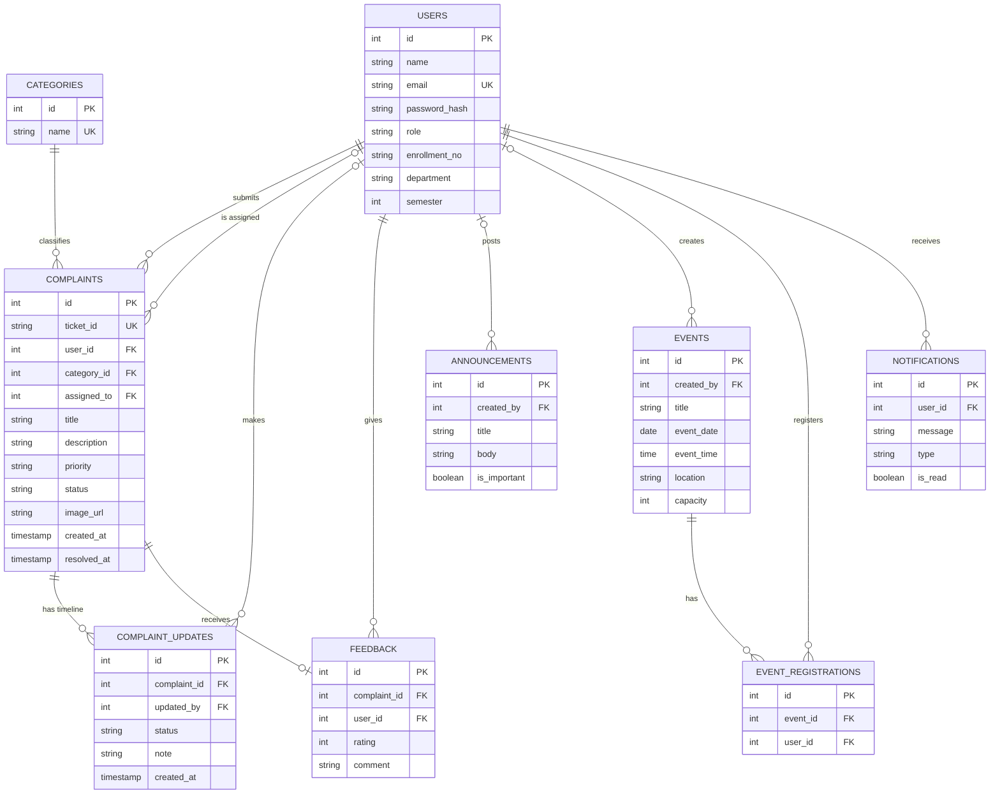

# CampusOS: ER Diagram

## Relationships

- One user submits many complaints (one-to-many).
- One category groups many complaints (one-to-many).
- One complaint has many status updates, which form its timeline (one-to-many).
- One complaint has at most one feedback (one-to-one).
- Users and events are many-to-many, resolved through `event_registrations`.
- One user receives many notifications (one-to-many).
